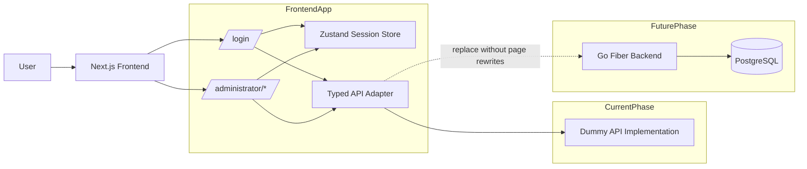
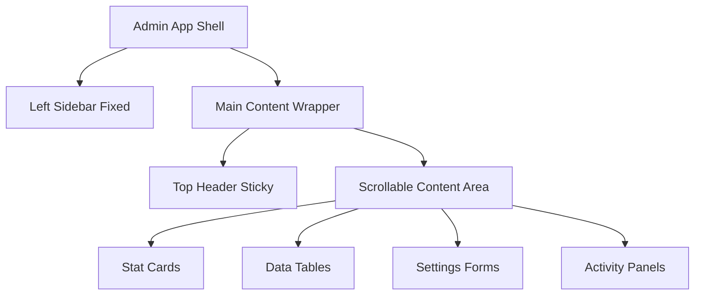
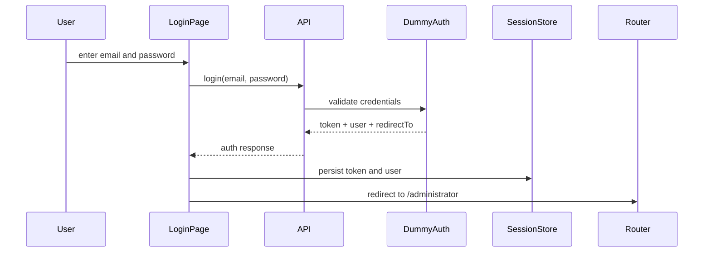
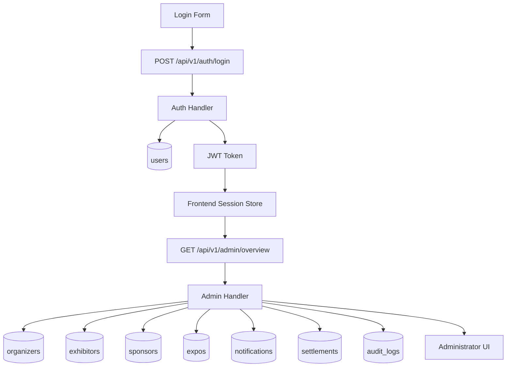

# Tandaza Phase 1 Spec
## Scope: Login + Administrator Console

## Objective

Build a modern Tandaza admin experience with:

- one login page
- role-aware session flow
- administrator overview
- full administrator navigation skeleton
- backend-ready API contracts
- dummy data first, with a clean path to real Go + PostgreSQL integration

This phase prioritizes interface structure, contracts, and consistency. It does not ship the full backend yet, but the frontend must behave as if it already exists.

## Included

- `/login`
- `/administrator`
- `/administrator/organizers`
- `/administrator/exhibitors`
- `/administrator/sponsors`
- `/administrator/expos`
- `/administrator/notifications`
- `/administrator/settlements`
- `/administrator/settings/email`
- `/administrator/settings/sms`
- `/administrator/settings/paystack`
- `/administrator/users`
- `/administrator/audit-logs`
- dummy auth and admin data behind a backend-shaped API layer

## Not Included Yet

- visitor dashboard
- exhibitor dashboard
- organizer dashboard
- sponsorship dashboard
- payments flow
- AI flow
- notifications engine implementation
- backend microservices split

## Product Rules

- The frontend must never import raw dummy data directly into pages.
- The frontend must consume a typed API layer only.
- Dummy API responses must match final backend response shapes.
- Backend replacement must not require page rewrites.
- Login must determine role from credentials.
- Protected admin routes must redirect unauthenticated users to `/login`.
- Authenticated users hitting `/login` must be redirected to their role home.

## Route Map

### Public
- `/login`

### Administrator
- `/administrator`
- `/administrator/organizers`
- `/administrator/exhibitors`
- `/administrator/sponsors`
- `/administrator/expos`
- `/administrator/notifications`
- `/administrator/settlements`
- `/administrator/settings/email`
- `/administrator/settings/sms`
- `/administrator/settings/paystack`
- `/administrator/users`
- `/administrator/audit-logs`

## Layout Spec

### Main Layout
- Left Sidebar: fixed
- Top Header: sticky
- Main Content Area: scrollable

### Sidebar Sections
- Overview
- Organizers
- Exhibitors
- Sponsors
- Expos
- Notifications
- Settlements
- Settings
  - Email
  - SMS
  - Paystack
- Users
- Audit Logs

## UI System

### Style Direction
- modern SaaS admin
- structured, not decorative
- strong spacing rhythm
- rounded cards
- compact, readable tables
- light and dark themes

### Core Components
- `AdminShell`
- `AdminSidebar`
- `AdminTopbar`
- `PageHeader`
- `StatCard`
- `DataTable`
- `StatusBadge`
- `ActivityList`
- `SystemHealthCard`
- `RoleDistributionCard`
- `SettingsFormCard`
- `LoginForm`
- `SessionGuard`

## Auth Contract

### POST `/api/v1/auth/login`

Request:

```json
{
  "email": "admin@tandaza.demo",
  "password": "admin123"
}
```

Response:

```json
{
  "token": "demo-token:usr_admin_001:administrator",
  "user": {
    "id": "usr_admin_001",
    "name": "Platform Administrator",
    "email": "admin@tandaza.demo",
    "role": "administrator",
    "avatarUrl": "/avatars/admin.svg",
    "companyName": "Tandaza"
  },
  "redirectTo": "/administrator"
}
```

### GET `/api/v1/auth/me`

Response:

```json
{
  "user": {
    "id": "usr_admin_001",
    "name": "Platform Administrator",
    "email": "admin@tandaza.demo",
    "role": "administrator",
    "avatarUrl": "/avatars/admin.svg",
    "companyName": "Tandaza"
  }
}
```

## Admin API Contract

### GET `/api/v1/admin/overview`
- stats
- roleDistribution
- systemHealth
- activities
- quickActions

### GET `/api/v1/admin/organizers`
- summary stats
- list rows

### GET `/api/v1/admin/exhibitors`
- summary stats
- list rows

### GET `/api/v1/admin/sponsors`
- summary stats
- list rows

### GET `/api/v1/admin/expos`
- summary stats
- list rows

### GET `/api/v1/admin/notifications`
- summary stats
- list rows

### GET `/api/v1/admin/settlements`
- summary stats
- list rows

### GET `/api/v1/admin/settings/email`
- config object

### GET `/api/v1/admin/settings/sms`
- config object

### GET `/api/v1/admin/settings/paystack`
- config object

### GET `/api/v1/admin/users`
- summary stats
- list rows

### GET `/api/v1/admin/audit-logs`
- summary stats
- list rows

## Demo Credentials

- `admin@tandaza.demo` / `admin123`
- `organizer@tandaza.demo` / `organizer123`
- `exhibitor@tandaza.demo` / `exhibitor123`
- `sponsorship@tandaza.demo` / `sponsorship123`
- `visitor@tandaza.demo` / `visitor123`

## Database Plan

Initial backend tables:

- `users`
- `organizers`
- `exhibitors`
- `sponsors`
- `expos`
- `notifications`
- `settlements`
- `email_settings`
- `sms_settings`
- `paystack_settings`
- `audit_logs`

## Acceptance Criteria

- Login works with demo credentials.
- Session persists across refreshes.
- Left sidebar is fixed.
- Top header is sticky.
- Main content scrolls independently.
- All admin pages share the same visual language.
- Tables, cards, buttons, and themes are consistent.
- Data comes through the API layer, not page-local mock constants.

## Diagram: System Overview



## Diagram: Layout



## Diagram: Login Flow



## Diagram: Final Backend Flow


